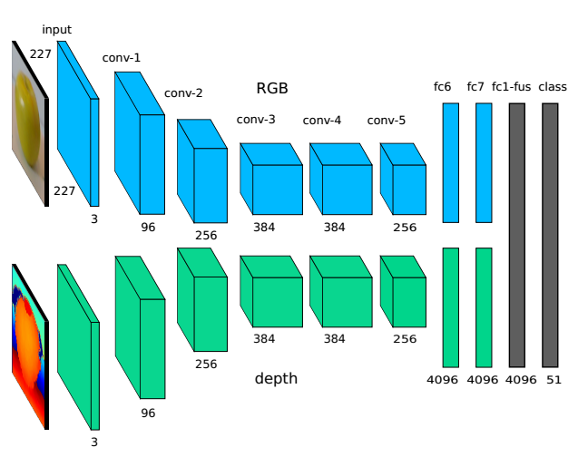
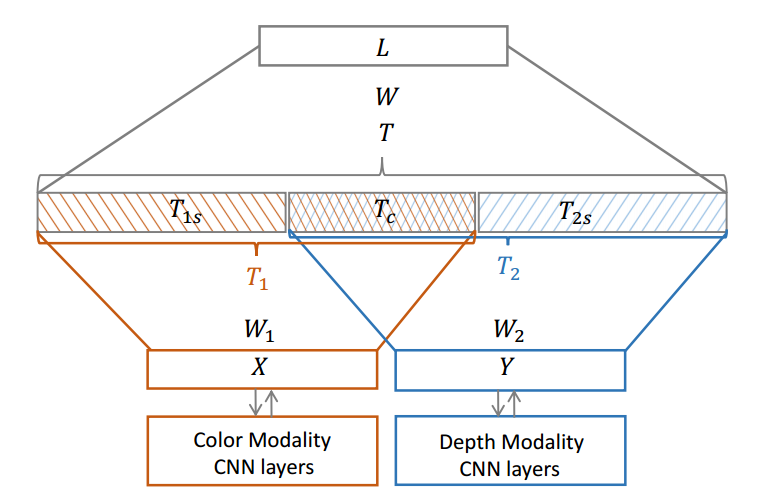
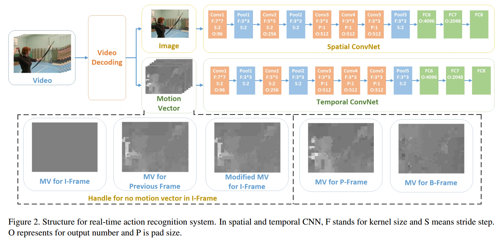

# Related Work: Multimodal features
Here are some related work about combining or fusing features from different modalities (e.g. RGB and optical flow data).

TODO:
- [ ] Read the following papers
- [ ] Find or think about appropriate methods for feature fusion

---
## Multimodal fusion for multimedia analysis: a survey
#### Pradeep K. Atrey, M. Anwar Hossain, Abdulmotaleb El Saddik, Mohan S. Kankanhalli
#### _Multimedia Systems 2010_

---
## Multimodal Deep Learning
#### Jiquan Ngiam, Aditya Khosla, Mingyu Kim, Juhan Nam, Honglak Lee, Andrew Y. Ng
###### Stanford University
#### _ICML 2011_

---
## Multimedia event detection with multimodal feature fusion and temporal concept localization
#### Sangmin Oh, Scott McCloskey, Ilseo Kim, Arash Vahdat, Kevin J. Cannons, Hossein Hajimirsadeghi, Greg Mori, A. G. Amitha Perera, Megha Pandey and Jason J. Corso
#### _MVA 2014_

---
## Two-Stream Convolutional Networks for Action Recognition in Videos
#### Karen Simonyan and Andrew Zisserman
###### University of Oxford
#### _NIPS 2014_

* Spatial: choose **pre-trained + last layer**
* Temporal: [optical flow](http://lmb.informatik.uni-freiburg.de/Publications/2004/Bro04a/) or [trajectory (iDT)](https://hal.inria.fr/hal-00873267v2) ==> choose **bi-directional optical flow**
* Fusion: choose **SVM**
  1. averaging
  2. training a multi-class linear SVM on stacked L2-normalised softmax scores as features
* best accuracy: 87% (UCF-101)

---
## Multimodal Deep Learning for Robust RGB-D Object Recognition
#### Andreas Eitel, Jost Tobias Springenberg, Luciano Spinello, Martin Riedmiller and Wolfram Burgard
#### _arXiv 2015_

---
## Action Recognition with Trajectory-Pooled Deep-Convolutional Descriptors
#### Limin Wang, Yu Qiao and Xiaoou Tang
###### The Chinese University of Hong Kong
#### _CVPR 2015_

* Extract Feature Maps: based on [Clarifai (ECCV 2014)](http://arxiv.org/abs/1311.2901) networks
  * spatial net: RGB input ==> [VGGNet (BMVC 2014)](http://www.robots.ox.ac.uk/~vgg/research/deep_eval/)
  * temporal net: stacking optical flow ([TVL1 (DAGM 2007)](http://www.icg.tugraz.at/publications/pdf/pockdagm07.pdf) algorithm)
  * output: really huge features (dim: H x Ｗ X L x N)
* Extract Trajectories: [iDT (ICCV 2013)](https://hal.inria.fr/hal-00873267v2)
* TDDs:
  * **feature normalization**: spatiotemporal & channel
  * **trajectory pooling**: sum-pooling of the normalized feature maps over the 3D volume centered at the trajectory
  * feature encoding: [Fisher vector (WACV 2013)](http://iris.usc.edu/outlines/papers/2013/sun_wacv13.pdf) --> SVM
* best accuracy: 91.5% (UCF-101)

---
## MMSS: Multi-modal Sharable and Specific Feature Learning for RGB-D Object Recognition
#### Anran Wang, Jianfei Cai, Jiwen Lu, and Tat-Jen Cham
###### Nanyang Technological University
#### _ICCV 2015_

---
## Real-time Action Recognition with Enhanced Motion Vector CNNs
#### Bowen Zhang, Limin Wang, Zhe Wang, Yu Qiao, Hanli Wang
###### Shenzhen Institutes of Advanced Technology
#### _CVPR 2016_

---
